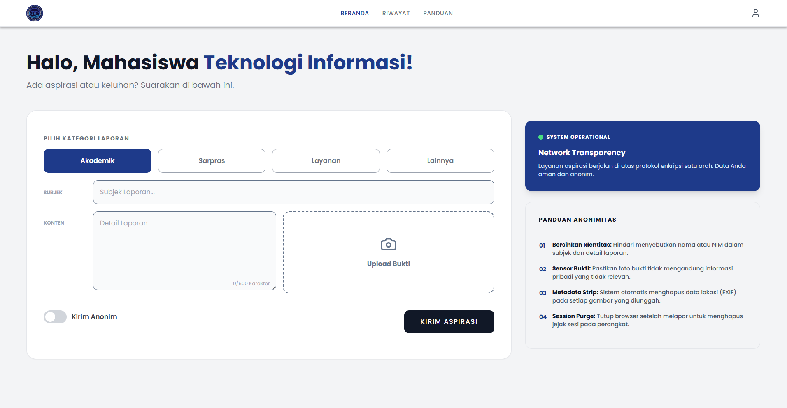
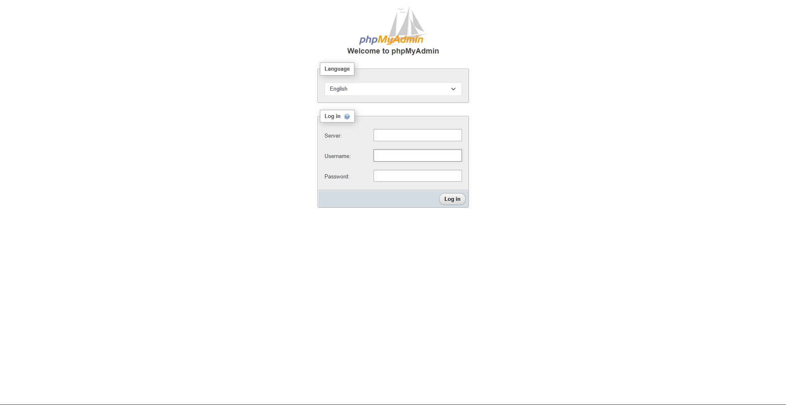

# 🐳 Panduan Operasional Docker - Project VocaTIonal

Dokumen ini berisi instruksi teknis cara menjalankan dan mengelola lingkungan pengembangan menggunakan Docker agar seluruh tim memiliki konfigurasi server yang seragam.

## 1. Persiapan Lingkungan (Pre-requisites)

Sebelum menjalankan perintah apa pun, pastikan perangkat Anda memenuhi syarat berikut:

* [**Docker Desktop**](https://www.docker.com/products/docker-desktop/): Wajib terinstal dan dalam status **Running** (ikon paus di taskbar berwarna hijau).
* [**Mode WSL 2**](https://medium.com/@janinehuang/how-to-upgrade-from-wsl1-to-wsl2-and-wslg-d9bb5f22ccdd): Pastikan Docker menggunakan *WSL 2 Engine* untuk performa terbaik di Windows.
* [**Bebaskan Port**](https://sentry.io/answers/kill-process-using-port-in-windows/): Pastikan aplikasi seperti XAMPP (Apache & MySQL) atau aplikasi lain yang menggunakan port `8080` dan `8081` sudah **Nonaktif** (Stop) untuk menghindari bentrokan (*port collision*).

### 1.1. Persiapan Lingkungan Menggunakan Video

| Penjelasan | Video |
| --- | --- |
| Persiapan lingkungan docker pada ekosistem windows, menggunakan Docker, Docker Compose, dan WSL 2. | [Link](https://drive.google.com/file/d/1BTZ9gKbQWn-BQef50ePOAj4gj-J7jSMw/view?usp=sharing) |
| Setup GitHub repository untuk version control dan collaboration | [Link](https://drive.google.com/file/d/1GKs3OIT-GJwWVogHOdU8z0urAmprO_sS/view?usp=sharing) |
| Setup Service Vocational menggunakan Docker Compose dengan GUI (Docker Desktop) | [Link](https://drive.google.com/file/d/1YSoDktAxjoclfIxxmfcJ20cnLkeMSpOn/view?usp=sharing) |

## 2. Instruksi Perintah (Command Line)

Gunakan terminal (CMD, PowerShell, atau Git Bash) tepat di dalam folder `vocational`, lalu gunakan perintah berikut:

| Perintah | Fungsi |
| --- | --- |
| `docker-compose up -d --build` | Membangun dan menjalankan server di latar belakang. Gunakan ini jika ada perubahan pada konfigurasi Docker atau saat pertama kali memulai. |
| `docker-compose up -d` | Menjalankan server yang sudah pernah dibangun sebelumnya tanpa membangun ulang. |
| `docker-compose down` | Mematikan seluruh layanan dan melepaskan penggunaan port di laptop Anda. |
| `docker-compose logs -f` | Melihat log (catatan aktivitas) server jika terjadi error pada PHP atau Database. |

## 3. Alamat Akses & Konfigurasi (Endpoints)

Setelah kontainer berstatus **Started**, Anda dapat mengakses layanan melalui browser:

* **Web Utama**: [http://localhost:8080](https://www.google.com/search?q=http://localhost:8080)
* Sistem secara otomatis membaca folder `public` sebagai pintu masuk utama aplikasi.

  

* **Database Management (phpMyAdmin)**: [http://localhost:8081](https://www.google.com/search?q=http://localhost:8081)

  

* **Server Name**: `db` (Gunakan kata `db` sebagai host di skrip PHP, **bukan** `localhost`).
* **Credentials**: Silakan merujuk pada file `.env` untuk detail Username dan Password.

## 4. Mekanisme Kerja File (Volume Mirroring)

Anda tidak perlu memindahkan file ke folder `C:\xampp\htdocs`.

* **Sinkronisasi Real-time**: Folder `vocational` di komputer Anda telah terhubung langsung dengan server di dalam Docker. Perubahan kode yang Anda simpan di VS Code akan langsung diterapkan di browser tanpa perlu *restart* Docker.
* **Persistensi Data**: Data database yang Anda buat di phpMyAdmin akan tersimpan secara permanen di volume Docker, sehingga data tidak akan hilang meskipun kontainer dimatikan.

## 5. Troubleshooting (Solusi Masalah Umum)

* **Error "Port is already allocated"**: Artinya port `8080` sedang digunakan aplikasi lain. Jalankan `netstat -ano | findstr :8080` untuk mencari PID-nya dan matikan aplikasi tersebut.
* **Koneksi Database Gagal**: Pastikan `DB_HOST` di file `.env` bernilai `db`.
* **Perubahan Skrip Tidak Muncul**: Coba bersihkan cache browser atau jalankan kembali `docker-compose up -d --build` jika Anda melakukan perubahan pada `Dockerfile`.

---
